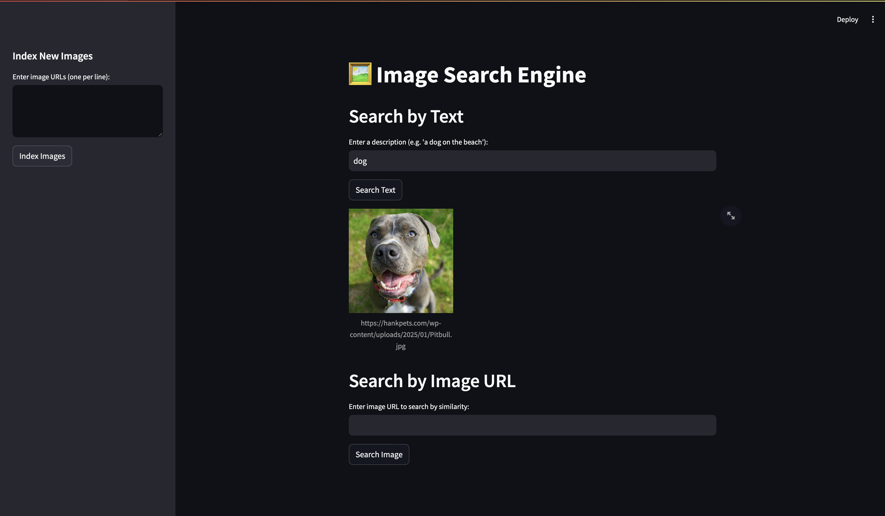

# Image Search Engine

## Features
- Index images via URL
- Search using text or image input
- Streamlit front-end for demo

## Run
```bash
pip install -r requirements.txt
uvicorn app.main:app --reload
```

### Frontend
```bash
streamlit run frontend/streamlit_app.py
```

## Endpoints
Go to google images , type the image name of what you want to index and click an image and "copy image address"
As of now the following urls of the images have been indexed\
`{ "urls": https://myplate-prod.azureedge.us/sites/default/files/styles/large/public/2020-10/Pancakes_527x323.jpg?itok=urFjVgTr , https://images.immediate.co.uk/production/volatile/sites/30/2020/08/flat-white-3402c4f.jpg , https://encrypted-tbn0.gstatic.com/images?}

- POST /index — `{ " https...}`
- GET /search/text?q="a dog"
- GET /search/image?image_url=http://...
"""

